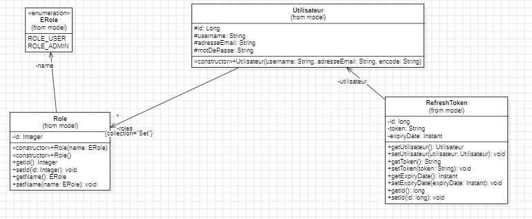
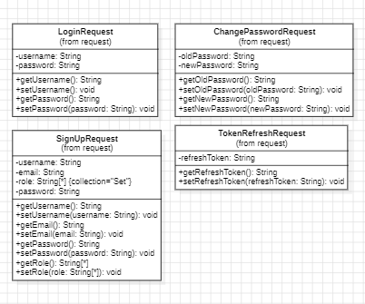
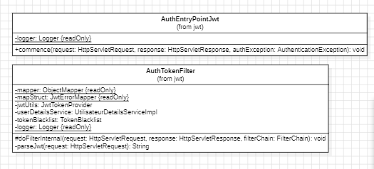
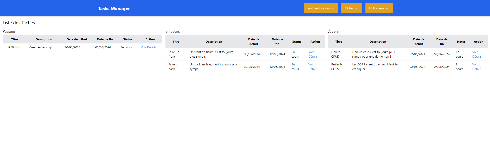
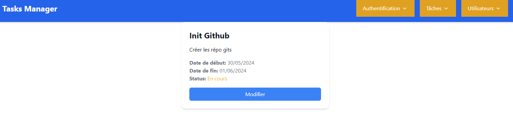
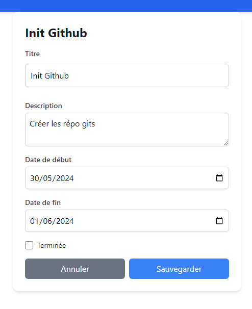

##  Bienvenue dans le rattrapage du Hackathon M1 AL 2024

Ce projet comprend un frontend et un backend pour la gestion des utilisateurs et des tâches via une interface web. Il inclut des fonctionnalités d'authentification, de création, de modification et de suppression de tâches et d'utilisateurs.

## Table des Matières

- [Technologies](#technologies)
- [API Authentification](#api-authentification)
- [API CRUD](#api-crud)
- [Frontend IHM](#frontend-ihm)
- [DevOps](#devops)
- [API Routes](#api-routes)
- [Ressources](#ressources)

## Technologies

### Frontend

- React
- TypeScript
- Axios
- React Router
- Context API

### Backend

- Spring Boot
- Java
- JWT (JSON Web Tokens)
- Spring Security

## API Authentification

Ce projet est une API RESTful développée avec Spring Boot pour gérer l'authentification et la gestion des utilisateurs, incluant des fonctionnalités d'inscription, de connexion, de vérification de token, de changement de mot de passe, et plus encore.

## Table des matières

- [Technologies Auth](#technologies-auth)
- [Installation Auth](#installation-auth)
- [Structure du Projet Auth](#structure-du-projet-auth)
- [Fonctionnalités Auth](#fonctionnalités-auth)
- [Endpoints API Auth](#endpoints-api-auth)

## Technologies Auth

- Spring Boot
- Spring Security
- JWT (JSON Web Token)
- Maven

## Installation Auth

1. Clonez le dépôt :
   ```bash
   git clone https://github.com/votre-repo/projet-api.git
2. Accédez au répertoire du projet :
    ```bash
    cd projet-api
3. Compilez et démarrez le projet avec Maven :
    ```bash
    mvn spring-boot:run

## Structure du Projet Auth

Le projet est structuré conformément à l'architecture hexagonale (ports et adaptateurs) et suit les principes de conception SOLID. Voici un aperçu de la structure du projet :

```css
src/
├── main/
│   ├── java/
│   │   └── fr/
│   │       └── esgi/
│   │           └── User_Task/
│   │               ├── application/
│   │               │   ├── advice/
│   │               │   │   ├── ErrorMessage.java
│   │               │   │   ├── TokenControllerAdvice.java
│   │               │   ├── configuration/
│   │               │   │   ├── SecurityConfig.java
│   │               │   ├── controller/
│   │               │   │   ├── ControllerAdvice.java
│   │               │   │   ├── UtilisateurController.java
│   │               │   │   ├── VerifyController.java
│   │               │   ├── exception/
│   │               │   │   ├── CustomExpiredJwtTokenException.java
│   │               │   │   ├── CustomMalformedJwtTokenException.java
│   │               │   │   ├── CustomTechnicalJwtException.java
│   │               │   │   ├── TokenRefreshException.java
│   │               │   ├── hexa/
│   │               │   │   ├── domain/
│   │               │   │   │   ├── api/
│   │               │   │   │   │   ├── IService.java
│   │               │   │   │   │   ├── TestService.java
│   │               │   │   │   ├── persistence/
│   │               │   │   │   │   ├── adapter/
│   │               │   │   │   │   │   ├── UtilisateurDao.java
│   │               │   │   │   ├── spi/
│   │               │   │   │   │   ├── IDao.java
│   │               │   │   │   ├── Test.java
│   │               │   ├── mapper/
│   │               │   │   ├── JwtErrorMapper.java
│   │               │   ├── model/
│   │               │   │   ├── Erole.java
│   │               │   │   ├── RefreshToken.java
│   │               │   │   ├── Role.java
│   │               │   │   ├── Utilisateur.java
│   │               │   ├── payload/
│   │               │   │   ├── request
│   │               │   │   │   ├── SignUpRequest.java
│   │               │   │   │   ├── TokenRefreshRequest.java
│   │               │   │   │   ├── ChangePasswordRequest.java
│   │               │   │   │   ├── LoginRequest.java
│   │               │   │   ├── response
│   │               │   │   │   ├── JwtResponse.java
│   │               │   │   │   ├── MessageResponse.java
│   │               │   │   │   ├── TokenRefreshResponse.java
│   │               │   │   │   ├── JwtErrorDTO.java
│   │               │   ├── repository/
│   │               │   │   ├── RefreshTokenRepository.java
│   │               │   │   ├── RoleRepository.java
│   │               │   │   ├── UtilisateurRepository.java
│   │               │   ├── security/
│   │               │   │   ├── jwt/
│   │               │   │   │   ├── AuthEntryPointJwt.java
│   │               │   │   │   ├── AuthTokenFilter.java
│   │               │   │   │   ├── JwtTokenProvider.java
│   │               │   │   ├── service/
│   │               │   │   │   ├── impl/
│   │               │   │   │   │   ├── UtilisateurDetailsServiceImpl.java
│   │               │   │   │   │   ├── UtilisateurDetailsImpl.java
│   │               │   │   │   ├── RefreshTokenService.java
│   │               │   │   │   ├── TokenBlacklist.java
│   │               ├── AuthentificationApplication.java
└── resources/
    └── application.properties
```

## Fonctionnalités Auth

### Authentification
- Inscription : Permet à un nouvel utilisateur de s'inscrire.
- Connexion : Permet à un utilisateur existant de se connecter.
- Vérification de Token : Vérifie la validité des tokens JWT.
- Rafraîchissement de Token : Permet de rafraîchir les tokens JWT expirés.
- Changement de Mot de Passe : Permet à un utilisateur de changer son mot de passe.

### Gestion des Utilisateurs
- Ajouter un Utilisateur : Permet d'ajouter un nouvel utilisateur.
- Récupérer un Utilisateur : Permet de récupérer les détails d'un utilisateur.
- Mettre à Jour un Utilisateur : Permet de mettre à jour les informations d'un utilisateur.
- Supprimer un Utilisateur : Permet de supprimer un utilisateur.

## Endpoints API Auth
### Authentification
- POST /api/auth/signup : Inscription d'un nouvel utilisateur.
- POST /api/auth/login : Connexion d'un utilisateur existant.
- POST /api/auth/refreshtoken : Rafraîchissement du token JWT.
- POST /api/auth/changepassword : Changement de mot de passe.
### Gestion des Utilisateurs
- POST /api/utilisateur/nouveau-utilisateur : Ajouter un nouvel utilisateur.
- GET /api/utilisateur/get-utilisateur-by-id : Récupérer un utilisateur par son ID.
- PUT /api/utilisateur/modifie-utilisateur : Mettre à jour les informations d'un utilisateur.
- DELETE /api/utilisateur/supprimer-utilisateur : Supprimer un utilisateur.

### Vérification de Token
- GET /api/verify : Vérifier la validité du token JWT.

## Ressources Auth





# API CRUD

Cette API permet de gérer les utilisateurs et les tâches. Elle inclut des fonctionnalités CRUD (Create, Read, Update, Delete) pour les deux entités, ainsi qu'un système d'authentification basé sur JWT (JSON Web Token).

## Table des Matières

- [Technologies CRUD](#technologies-crud)
- [Installation CRUD](#installation-crud)
- [Structure du Projet CRUD](#structure-du-projet-crud)
- [Fonctionnalités CRUD](#fonctionnalités-crud)
- [Endpoints API CRUD](#endpoints-api-crud)

## Technologies CRUD

- Spring Boot
- Java
- JWT (JSON Web Tokens)
- Lombok

## Installation CRUD

1. Clonez le dépôt :
   ```bash
   git clone https://github.com/votre-repo/votre-projet.git
   ```
2. Accédez au répertoire du projet :
   ```bash
   cd votre-projet
   ```
3. Configurez le fichier `application.properties` avec vos informations de base de données.
4. Démarrez l'application :
   ```bash
   ./mvnw spring-boot:run
   ```

## Structure du Projet CRUD

```css
src/
├── main/
│   ├── java/
│   │   ├── fr/
│   │   │   ├── esgi/
│   │   │   │   ├── User_Task/
│   │   │   │   │   ├── application/
│   │   │   │   │   │   ├── controller/
│   │   │   │   │   │   │   ├── TacheController.java
│   │   │   │   │   │   │   ├── UtilisateurController.java
│   │   │   │   │   │   ├── dto/
│   │   │   │   │   │   │   ├── tache/
│   │   │   │   │   │   │   │   ├── InTacheDto.java
│   │   │   │   │   │   │   │   ├── OutTacheDto.java
│   │   │   │   │   │   │   ├── permission/
│   │   │   │   │   │   │   ├── JwtPayload.java
│   │   │   │   │   │   │   ├── InUtilisateurDto.java
│   │   │   │   │   │   │   ├── OutUtilisateurDto.java
│   │   │   │   │   ├── mapper/
│   │   │   │   │   │   ├── DtoToDomainUtilisateurMapper.java
│   │   │   │   │   │   ├── TacheDtoToDomainMapper.java
│   │   │   │   │   │── DataInitializer.java
│   │   │   │   │   │── config/
│   │   │   │   │   │   ├── SecurityConfig.java
│   │   │   │   │   │   ├── FilterConfiguration.java
│   │   │   │   │   ├── domain/
│   │   │   │   │   │   ├── ports/
│   │   │   │   │   │   │   ├── api/
│   │   │   │   │   │   │   │   ├── ITacheService.java
│   │   │   │   │   │   │   │   ├── IUtilisateurService.java
│   │   │   │   │   │   │   │   ├── TacheService.java
│   │   │   │   │   │   │   │   ├── UtilisateurService.java
│   │   │   │   │   │   │   ├── spi/
│   │   │   │   │   │   │   │   ├── ITacheDao.java
│   │   │   │   │   │   │   │   ├── IUtilisateurDao.java
│   │   │   │   │   │   │   ├── Tache.java
│   │   │   │   │   │   │   ├── Utilisateur.java
│   │   │   │   │   │   ├── filter/
│   │   │   │   │   │   │   ├── PermissionsFilter.java
│   │   │   │   │   │   ├── infrastructure/
│   │   │   │   │   │   │   ├── adapter/
│   │   │   │   │   │   │   │   ├── TacheDao.java
│   │   │   │   │   │   │   │   ├── UtilisateurDao.java
│   │   │   │   │   │   │   ├── entity/
│   │   │   │   │   │   │   │   ├── TacheEntity.java
│   │   │   │   │   │   │   │   ├── UtilisateurEntity.java
│   │   │   │   │   │   │   ├── mapper/
│   │   │   │   │   │   │   │   ├── EntityToDomainMapper.java
│   │   │   │   │   │   │   │   ├── TacheDomainToEntityMapper.java
│   │   │   │   │   │   │   ├── repository/
│   │   │   │   │   │   │   │   ├── TacheRepository.java
│   │   │   │   │   │   │   │   ├── UtilisateurRepository.java
│   │   │   │   ├── UserTaskApplication.java
├── resources/
│   ├── application.properties
```

## Fonctionnalités CRUD

### Gestion des Autorisations

#### Fonctionnement de l'Authentification et des Autorisations
- L'API utilise un système d'authentification basé sur les JWT pour sécuriser les endpoints. Voici comment cela fonctionne :

- Génération du JWT : Lorsqu'un utilisateur se connecte via l'API d'authentification, un JWT est généré et renvoyé au client. Ce JWT contient les informations de l'utilisateur, y compris ses rôles.

- En-tête d'Autorisation : Pour accéder aux endpoints sécurisés, le client doit inclure le JWT dans l'en-tête Authorization de chaque requête HTTP sous la forme Bearer <JWT>.

- Filtre de Permissions : Un filtre de permissions (PermissionsFilter) est appliqué aux requêtes pour vérifier le JWT et s'assurer que l'utilisateur a les autorisations nécessaires pour accéder à l'endpoint.

### Gestion des Tâches

- Création, lecture, mise à jour et suppression de tâches.

### Gestion des Utilisateurs

- Création, lecture, mise à jour et suppression d'utilisateurs.

## Endpoints API CRUD

### Tâches

- **GET /api/taches/get-all-taches** : Récupérer toutes les tâches.
- **GET /api/taches/get-tache-by-id/{id}** : Récupérer une tâche par son ID.
- **POST /api/taches/nouveau-tache** : Créer une nouvelle tâche.
- **PUT /api/taches/modifie-tache/{id}** : Mettre à jour une tâche existante.
- **DELETE /api/taches/supprimer-tache/{id}** : Supprimer une tâche.

### Utilisateurs

- **GET /api/utilisateurs/get-all-utilisateurs** : Récupérer tous les utilisateurs.
- **GET /api/utilisateurs/get-utilisateur-by-id/{id}** : Récupérer un utilisateur par son ID.
- **POST /api/utilisateurs/nouveau-utilisateur** : Créer un nouvel utilisateur.
- **PUT /api/utilisateurs/modifie-utilisateur/{id}** : Mettre à jour un utilisateur existant.
- **DELETE /api/utilisateurs/supprimer-utilisateur/{id}** : Supprimer un utilisateur.


## Frontend IHM

Ce projet frontend permet la gestion des utilisateurs et des tâches via une interface web. Il inclut des fonctionnalités d'authentification, de création, de modification et de suppression de tâches et d'utilisateurs.

## Table des matières

- [Technologies IHM](#technologies-ihm)
- [Installation IHM](#installation-ihm)
- [Structure du Projet IHM](#structure-du-projet-ihm)
- [Fonctionnalités IHM](#fonctionnalités-ihm)
- [API Routes IHM](#api-routes-ihm)
- [Contexte IHM](#contexte-ihm)
- [Composants IHM](#composants-ihm)

## Technologies IHM

- React
- TypeScript
- Axios
- React Router
- Context API

## Installation IHM

1. Clonez le dépôt :
   ```bash
   git clone https://github.com/Rattrapage-Hackathon-M1/Frontend.git
    ```
2. Accédez au répertoire du projet :
    ```bash
    cd projet-frontend
    ```
3. Installez les dépendances :
    ```bash
    npm install
    ```
4. Démarrez l'application :
    ```bash
    npm start
    ```

## Structure du Projet IHM

```css
src/
├── components/
│   ├── Authentification/
│   │   ├── Login.tsx
│   │   ├── Signup.tsx
│   │   ├── VerifyToken.tsx
│   │   ├── ChangePassword.tsx
│   │   ├── Logout.tsx
│   │   ├── RefreshToken.tsx
│   ├── Tasks/
│   │   ├── TaskList.tsx
│   │   ├── TaskCreator.tsx
│   │   ├── TaskDetails.tsx
│   ├── Users/
│   │   ├── UserCreator.tsx
│   │   ├── UserList.tsx
│   │   ├── UserDetails.tsx
├── context/
│   ├── AuthContext.tsx
│   ├── TaskContext.tsx
├── router/
│   ├── apiRoutes.tsx
│   ├── index.tsx
├── App.tsx
├── main.tsx
```

## Fonctionnalités IHM

### Authentification
- Login : Permet à un utilisateur de se connecter.
- Signup : Permet à un nouvel utilisateur de s'inscrire.
- VerifyToken : Vérifie la validité du jeton d'authentification.
- ChangePassword : Permet à un utilisateur de changer son mot de passe.
- Logout : Permet à un utilisateur de se déconnecter.
- RefreshToken : Rafraîchit le jeton d'authentification.

### Gestion des Tâches
- TaskList : Affiche la liste des tâches, classées par statut (passées, en cours, à venir).
- TaskCreator : Permet de créer une nouvelle tâche.
- TaskDetails : Affiche les détails d'une tâche spécifique.

### Gestion des Utilisateurs
- UserList : Affiche la liste des utilisateurs.
- UserCreator : Permet de créer un nouvel utilisateur.
- UserDetails : Affiche les détails d'un utilisateur spécifique.

## API Routes IHM
Les routes API sont définies dans apiRoutes.tsx :

  ```typescript
    const API_BASE_URL = 'http://localhost:8000';

    export const API_ROUTES = {
      TACHE: {
        GET_ALL: `${API_BASE_URL}/tache/get-all-taches`,
        CREATE: `${API_BASE_URL}/tache/nouveau-tache`,
      },
      AUTH: {
        LOGIN: `${API_BASE_URL}/auth/login`,
        SIGNUP: `${API_BASE_URL}/auth/signup`,
        VERIFY_TOKEN: `${API_BASE_URL}/auth/verifytoken`,
        LOGOUT: `${API_BASE_URL}/auth/logout`,
        CHANGE_PASSWORD: `${API_BASE_URL}/auth/changepassword`,
        REFRESH_TOKEN: `${API_BASE_URL}/auth/refreshtoken`,
      },
      UTILISATEUR: {
        GET_ALL: `${API_BASE_URL}/utilisateur/get-all-utilisateurs`,
        CREATE: `${API_BASE_URL}/utilisateur/nouveau-utilisateur`,
        GET_BY_ID: `${API_BASE_URL}/utilisateur/get-utilisateur-by-id`,
        UPDATE: `${API_BASE_URL}/utilisateur/modifie-utilisateur`,
        DELETE: `${API_BASE_URL}/utilisateur/supprimer-utilisateur`,
      },
    };
  ```


## Contexte IHM
### AuthContext
Le AuthContext gère l'état d'authentification de l'application. Il stocke les informations de l'utilisateur, le jeton d'authentification et l'état de connexion.

### TaskContext
Le TaskContext gère l'état des tâches dans l'application. Il stocke la liste des tâches et fournit des actions pour les manipuler (ajout, mise à jour, suppression).

## Composants IHM
### Authentification
- Login.tsx : Formulaire de connexion.
- Signup.tsx : Formulaire d'inscription.
- VerifyToken.tsx : Vérifie la validité du jeton.
- ChangePassword.tsx : Formulaire pour changer de mot de passe.
- Logout.tsx : Gère la déconnexion.
- RefreshToken.tsx : Rafraîchit le jeton d'authentification.
### Tâches
- TaskList.tsx : Affiche une liste de tâches classées par statut.
- TaskCreator.tsx : Formulaire de création de tâches.
- TaskDetails.tsx : Affiche les détails d'une tâche spécifique.
### Utilisateurs
- UserList.tsx : Affiche une liste d'utilisateurs.
- UserCreator.tsx : Formulaire de création d'utilisateurs.
- UserDetails.tsx : Affiche les détails d'un utilisateur spécifique.

## Ressources





# DEVOPS

## Table des matières

- [Description](#description)
- [Les Services](#installation)
- [CI/CD](#cicd)
- [Créer et configurer le Docker Swarm](#créer-et-configurer-le-docker-swarm)

## Description

Ce répository contient les fichiers de configuration, la CI/CD et les scripts de déploiement pour le projet DevOps.
Il sera également utilisé pour la mise en place de NGINX et Docker Swarm.

## Les Services
### auth

Le service d'authentification est un service qui permet de gérer les utilisateurs et les rôles. Il est basé sur une API développée en Java Spring Boot et une base de données PostgreSQL.

### postgres_auth

Le service postgres_auth est une base de données PostgreSQL qui est utilisée par le service auth.

### api-crud

Le service api-crud est l'api développée également en Java qui est utilisée pour générer des tâches ou des utilisateurs.

### postgres_crud

Le service postgres_crud est une base de données PostgreSQL qui est utilisée par le service api-crud.

### nginx

Le service NGINX est un reverse proxy qui permet de rediriger les requêtes vers les différents services.

### front

Le service front est une application web développée en REACT qui permet d'interfacer les deux APIs.

## CICD

Chaque répository de l'application est configuré pour utiliser GitHub Actions pour la CI/CD. Les fichiers de configuration se trouvent dans le répository de chaque service.
Chaque repository contient un fichier `Dockerfile` qui permet de construire une image Docker de l'application.
Sur chaque repository, lors d'un push sur la branche `main`, une github action est déclenchée pour vérifier que l'applications build correctement et que les tests passent.

Sur chaque repository, lors d'un push d'un nouveau tag, une github action est déclenchée pour construire l'image Docker et la pousser sur le registry.

## Créer et configurer le Docker Swarm

**Étape 1 : Initialiser le Docker Swarm**

```sh
docker swarm init
```

Cette commande va initialiser un Docker Swarm sur votre machine actuelle. La sortie de la commande vous donnera un token à utiliser pour ajouter des nœuds supplémentaires au cluster Swarm.

**Étape 2 : Ajouter des nœuds (optionnel)**

Si vous avez d'autres machines et souhaitez les ajouter au Swarm, utilisez le token fourni par la commande précédente :

```sh
docker swarm join --token <TOKEN> <MANAGER_IP>:2377
```

### 2. Déployer les services avec Docker Compose

Créez un fichier nommé `docker-compose.yml` avec le contenu que vous avez fourni, puis utilisez la commande suivante pour déployer vos services dans le Swarm :

```sh
docker stack deploy -c docker-compose.yml your_stack_name
```

### 3. Configurer Prometheus pour superviser les services

**Étape 1 : Créer un fichier de configuration pour Prometheus**

Créez un fichier nommé `prometheus.yml` avec la configuration suivante :

```yaml
global:
  scrape_interval: 15s

scrape_configs:
  - job_name: 'docker'
    static_configs:
      - targets: ['node1:9090', 'node2:9090', 'node3:9090'] # Ajoutez ici les adresses IP et ports de vos nœuds Docker
    metrics_path: /metrics
```

**Étape 2 : Ajouter Prometheus à votre Docker Compose**

Ajoutez la configuration pour Prometheus et un exporter Node (node-exporter) dans votre fichier `docker-compose.yml` :

```yaml
version: "3.8"
services:
  postgres_auth:
    container_name: postgres_auth
    image: postgres:latest
    environment:
      POSTGRES_USER: postgres
      POSTGRES_PASSWORD: 1234
      POSTGRES_DB: postgres
    ports:
      - 5432:5432

  auth:
    image: ghcr.io/rattrapage-hackathon-m1/authentification:v1.1.8
    ports:
      - 8001:8080
    environment:
      - SPRING_DATASOURCE_URL=jdbc:postgresql://postgres_auth:5432/postgres
      - SPRING_DATASOURCE_USERNAME=postgres
      - SPRING_DATASOURCE_PASSWORD=1234
    depends_on:
      - postgres_auth
    deploy:
      replicas: 1
      restart_policy:
        condition: on-failure

  postgres_crud:
    image: postgres:latest
    environment:
      POSTGRES_USER: postgres
      POSTGRES_PASSWORD: 1234
      POSTGRES_DB: crud
    ports:
      - 5433:5432

  api-crud:
    image: ghcr.io/rattrapage-hackathon-m1/api-crud:v1.3.0
    environment:
      - SPRING_DATASOURCE_URL=jdbc:postgresql://postgres_crud:5432/crud
      - SPRING_DATASOURCE_USERNAME=postgres
      - SPRING_DATASOURCE_PASSWORD=1234
    deploy:
      replicas: 1
      restart_policy:
        condition: on-failure
    depends_on:
      - postgres_crud

  nginx:
    image: nginx:1.25.5-alpine-slim
    ports:
      - 8000:80
    volumes:
      - "./nginx/nginx.conf:/etc/nginx/conf.d/default.conf"

  front:
    image: ghcr.io/rattrapage-hackathon-m1/frontend:v0.0.1
    ports:
      - "5173:5173"
    deploy:
      replicas: 1
      restart_policy:
        condition: on-failure

  prometheus:
    image: prom/prometheus
    volumes:
      - ./prometheus.yml:/etc/prometheus/prometheus.yml
    ports:
      - "9090:9090"
    deploy:
      replicas: 1

  node-exporter:
    image: prom/node-exporter
    ports:
      - "9100:9100"
    deploy:
      mode: global
```

Ce fichier Docker Compose ajoutera Prometheus et node-exporter à votre déploiement. Node-exporter sera déployé sur chaque nœud du Swarm.

**Étape 3 : Déployer à nouveau les services**

Pour déployer les nouvelles configurations, utilisez la commande :

```sh
docker stack deploy -c docker-compose.yml your_stack_name
```

